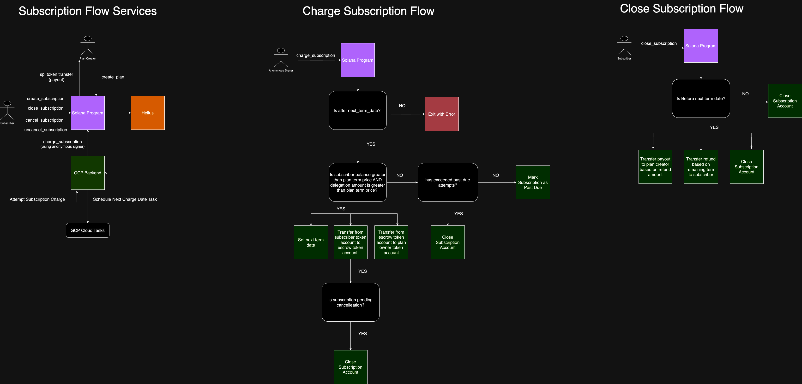

# SolSubs Program

### Motivation

Subscriptions should be easy, transparent, and permissionless. Utilizing the Solana blockchain and the delegation functionality in the SPL token library, SolSubs aims to provide a solution to these problems. Any subscriber should be able to manage their own subscription with total control. Any business should have a thoughtful and expressive interface to create subscriptions on Solana.

### Architecture

